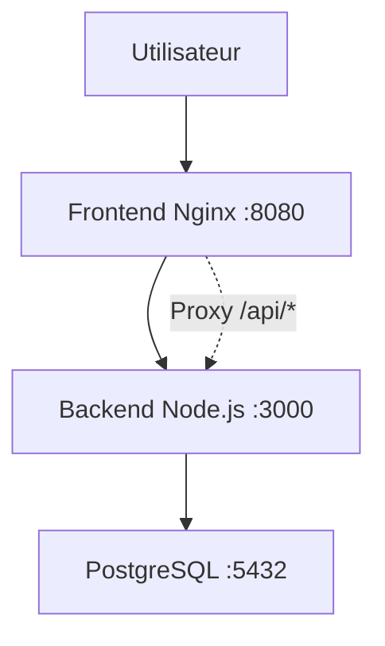

# VitalSync

Application de suivi médical et sportif avec architecture microservices conteneurisée.

## Description

VitalSync permet aux utilisateurs de suivre leurs données médicales et sportives via une interface web simple. L'application est composée d'un front-end statique servi par Nginx, d'un back-end API en Node.js/Express, et d'une base de données PostgreSQL.

## Architecture

```
Frontend (Nginx) <--HTTP--> Backend (Node.js) <--DB--> PostgreSQL
```

Le front-end sert les fichiers statiques et proxy les requêtes `/api/*` vers le back-end. Le back-end expose des endpoints REST et se connecte à la DB pour persister les données.

## Prérequis

- Docker >= 20.10
- Docker Compose >= 2.0
- Node.js 18 (pour développement local)
- Git

## Lancement en local

1. Cloner le repo :
   ```bash
   git clone https://github.com/John-william28/VitalSync.git
   cd vitalsync
   ```

2. Copier le fichier d'environnement :
   ```bash
   cp .env.example .env
   # Éditer .env avec vos valeurs
   ```

3. Lancer avec Docker Compose :
   ```bash
   docker-compose up --build
   ```

L'application sera accessible sur `http://localhost:8080` (front-end) et `http://localhost:3000` (back-end API).

## Pipeline CI/CD

La pipeline GitHub Actions se déclenche sur push vers `develop`/`main` et PR vers `main` :
- **Lint & Tests** : Installation deps, exécution Jest, ESLint.
- **Build & Push** : Construction images Docker, tag par SHA, push vers GHCR.
- **Deploy Staging** : Simulation déploiement avec docker-compose, health check du back-end.

## Choix techniques

- **Node.js 18** : Léger, écosystème riche pour API REST.
- **Express** : Framework minimal pour API.
- **PostgreSQL** : Robuste pour données structurées.
- **Nginx** : Efficace pour servir statique et proxy.
- **Docker** : Isolation, portabilité, reproductibilité.
- **GitHub Actions** : Intégration native avec repo.
- **ESLint** : Qualité code, conformité standards.
- **Jest** : Tests unitaires fiables.

## Schéma d'architecture

